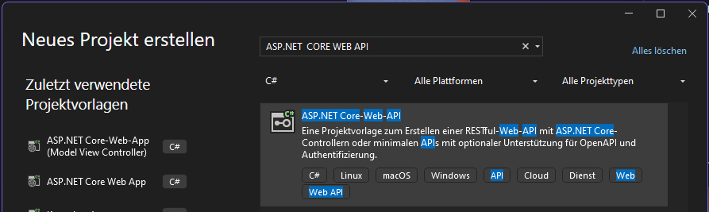
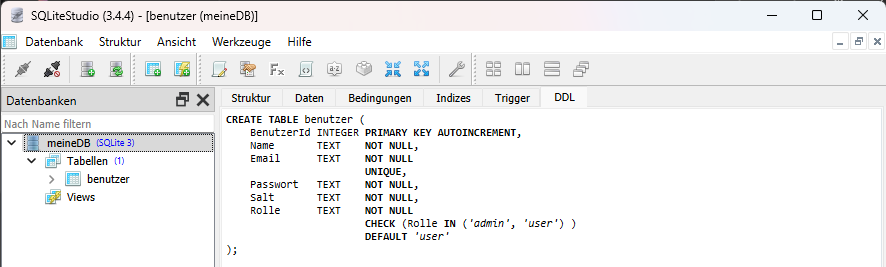
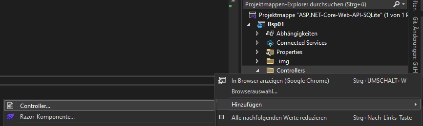
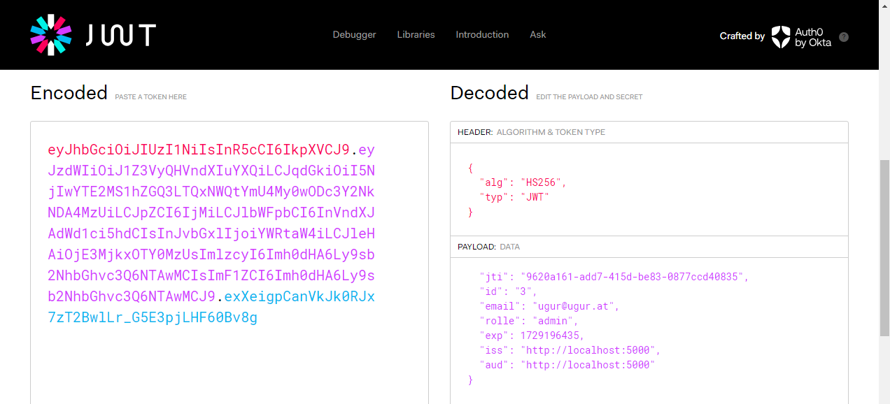
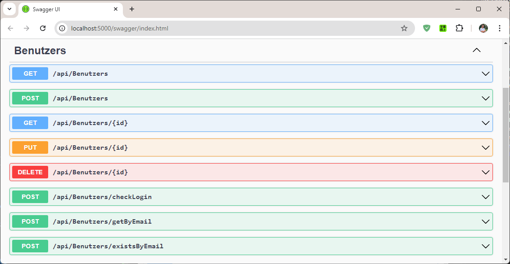
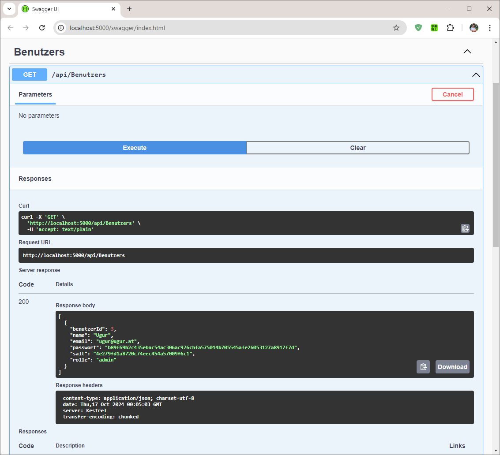
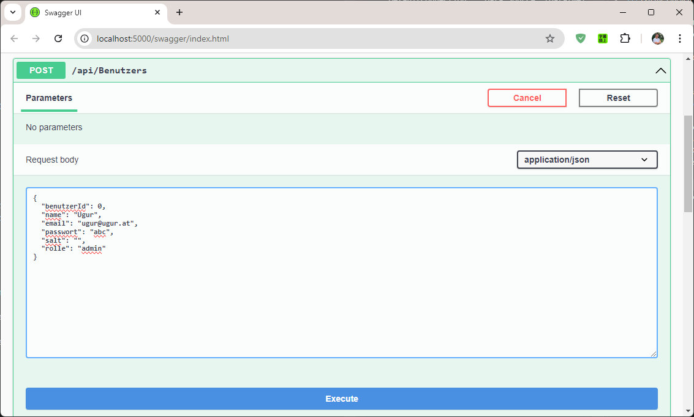
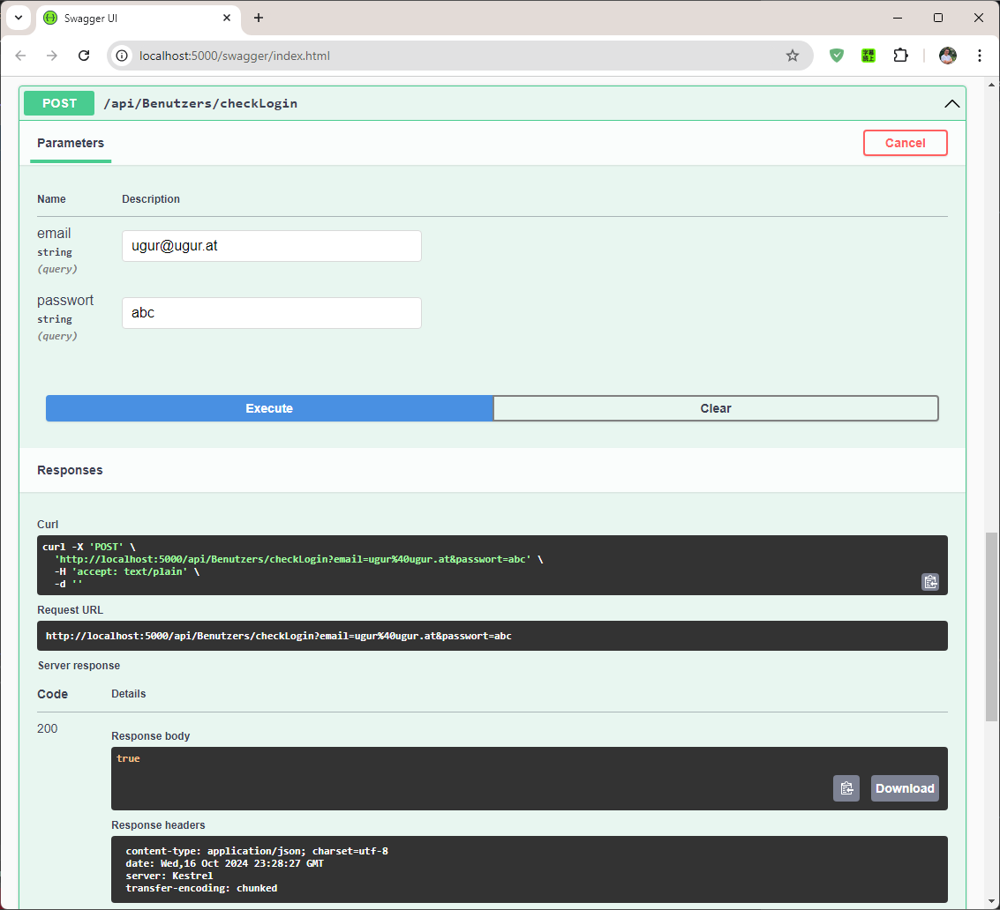


# ASP.NET Core Web API mit SQLite (Grundlagen)

mit appsettings + DI + Services konsumieren  (DI: Dependency Injektion)

Dieses Projekt demonstriert die Implementierung einer ASP.NET Core Web API mit SQLite. Es enthält eine Benutzerregistrierung, Login, sowie CRUD-Operationen für Benutzer und verwendet Dependency Injection (DI) für die Services.

Um ein Inhaltsverzeichnis für das vorhandene Dokument zu erstellen, können wir eine einfache Auflistung der Hauptabschnitte des Dokuments bereitstellen. Da das Dokument Abschnitte mit Links "Zurück zum Inhaltsverzeichnis" enthält, werde ich diese verwenden, um die Struktur zu erstellen:


### Inhaltsverzeichnis

- [ASP.NET Core Web API mit SQLite (Grundlagen)](#aspnet-core-web-api-mit-sqlite-grundlagen)
    - [Inhaltsverzeichnis](#inhaltsverzeichnis)
- [Projekt](#projekt)
  - [Ziel und Anforderungen](#ziel-und-anforderungen)
  - [Anforderungen:](#anforderungen)
  - [Eingesetzte Technologien](#eingesetzte-technologien)
  - [Aufbau des Projekts](#aufbau-des-projekts)
  - [API Übersichtstabelle](#api-übersichtstabelle)
    - [Registrierung](#registrierung)
    - [Login](#login)
    - [Benutzer](#benutzer)
- [Projekt Erstellen](#projekt-erstellen)
  - [NuGet Pakete installieren](#nuget-pakete-installieren)
  - [/Data/meineDB.db erstellen](#datameinedbdb-erstellen)
  - [Gerüst Aufbau ohne appsettings](#gerüst-aufbau-ohne-appsettings)
  - [Gerüst Aufbau mit appsettings.json, Scaffold](#gerüst-aufbau-mit-appsettingsjson-scaffold)
  - [/Data/Benutzer.cs | Datentypen im Model anpassen](#databenutzercs--datentypen-im-model-anpassen)
  - [/Program.cs | Datenbank Konfigurieren](#programcs--datenbank-konfigurieren)
  - [/Properties/launchSettings.json](#propertieslaunchsettingsjson)
  - [Interfaces/IBenutzer.cs](#interfacesibenutzercs)
  - [Services/BenutzerService.cs](#servicesbenutzerservicecs)
  - [Program.cs | BenutzerService registerieren](#programcs--benutzerservice-registerieren)
  - [appsettings.json | Konfiguration](#appsettingsjson--konfiguration)
  - [Program.cs | Konfiguration aus appsettings.json laden](#programcs--konfiguration-aus-appsettingsjson-laden)
  - [/Controllers/RegistrierenController.cs erstellen](#controllersregistrierencontrollercs-erstellen)
    - [API Dokumentation](#api-dokumentation)
      - [1. Benutzer Registrierung](#1-benutzer-registrierung)
      - [2. Passwort ändern](#2-passwort-ändern)
  - [/Controllers/LoginController.cs erstellen](#controllerslogincontrollercs-erstellen)
    - [API Dokumentation](#api-dokumentation-1)
      - [1. Benutzer Login](#1-benutzer-login)
  - [jwt token auslesen](#jwt-token-auslesen)
  - [Program.cs | Konfiguration für JWT-Token](#programcs--konfiguration-für-jwt-token)
  - [Program.cs | Authorize BUTTON in SwaggerUI, JWT Authentifizierung](#programcs--authorize-button-in-swaggerui-jwt-authentifizierung)
  - [/Controllers/BenutzerController.cs erstellen](#controllersbenutzercontrollercs-erstellen)
    - [API Dokumentation](#api-dokumentation-2)
      - [1. Alle Benutzer abrufen](#1-alle-benutzer-abrufen)
      - [2. Benutzer nach ID abrufen](#2-benutzer-nach-id-abrufen)
      - [3. Benutzer erstellen](#3-benutzer-erstellen)
      - [4. Benutzer aktualisieren](#4-benutzer-aktualisieren)
      - [5. Benutzer löschen](#5-benutzer-löschen)
      - [6. Benutzer anhand der E-Mail abrufen](#6-benutzer-anhand-der-e-mail-abrufen)
      - [7. Passwort überprüfen](#7-passwort-überprüfen)
  - [Ergebnis](#ergebnis)
  - [WeatherForecast Entfernen](#weatherforecast-entfernen)
  - [Installation, Deployment](#installation-deployment)
    - [1. **Datenbank einrichten (DB-First Ansatz)**](#1-datenbank-einrichten-db-first-ansatz)
      - [Schritte zur Einrichtung der Datenbank:](#schritte-zur-einrichtung-der-datenbank)
    - [2. API und Webseite veröffentlichen](#2-api-und-webseite-veröffentlichen)
      - [API in Visual Studio 2022 veröffentlichen:](#api-in-visual-studio-2022-veröffentlichen)
    - [3. Konfiguration](#3-konfiguration)
  - [API Konfiguration](#api-konfiguration)
  - [Zugangsdaten](#zugangsdaten)
  - [Git Konto wechseln und commiten](#git-konto-wechseln-und-commiten)
  - [Hinweise](#hinweise)
  - [Entwickler](#entwickler)

-----

# Projekt

## Ziel und Anforderungen
Das Ziel des Projekts ist es, die Grundlagen einer Web API zu vermitteln, die mit ASP.NET Core und SQLite arbeitet. 

  [Zurück zum Inhaltsverzeichnis](#top)

## Anforderungen:
- .NET 6.0 oder höher
- SQLite als Datenbank
- Postman oder eine andere API-Testumgebung für API-Aufrufe
- Visual Studio 2022

  [Zurück zum Inhaltsverzeichnis](#top)


## Eingesetzte Technologien
- ASP.NET Core 6.0
- SQLite
- Entity Framework Core
- JWT-Authentifizierung
- Dependency Injection (DI)
- **Swagger** zur API-Dokumentation und Testzwecken

  [Zurück zum Inhaltsverzeichnis](#top)

---

## Aufbau des Projekts
Das Projekt ist in mehrere Schichten unterteilt, um die Verantwortlichkeiten zu trennen:
- **Controllers**: Enthält die API-Endpunkte (z.B. Benutzer, Login, Registrierung).
- **Services**: Die Business-Logik, wie Benutzerregistrierung und Passwortüberprüfung.
- **Data**: Konfiguration des Datenbankzugriffs über Entity Framework Core.
- **Interfaces**: Definiert die Service-Schnittstellen für DI.

  [Zurück zum Inhaltsverzeichnis](#top)

---


## API Übersichtstabelle

### Registrierung
| Methode | URL                  | Beschreibung                                      | Authentifizierung |
|---------|----------------------|---------------------------------------------------|-------------------|
| POST    | /api/registrieren     | Einen neuen Benutzer registrieren                 | Keine             |
| PUT     | /api/registrieren     | Passwort eines Benutzers ändern                   | Keine             |

### Login
| Methode | URL                  | Beschreibung                            | Authentifizierung |
|---------|----------------------|------------------------------------------|-------------------|
| POST    | /api/login            | Benutzer-Login und Token erhalten        | Keine             |

### Benutzer
| Methode | URL                              | Beschreibung                          | Authentifizierung |
|---------|----------------------------------|----------------------------------------|-------------------|
| GET     | /api/benutzers                   | Alle Benutzer abrufen                 | JWT erforderlich  |
| GET     | /api/benutzers/{id}              | Benutzer nach ID abrufen              | JWT erforderlich  |
| POST    | /api/benutzers                   | Neuen Benutzer erstellen              | JWT erforderlich  |
| PUT     | /api/benutzers/{id}              | Benutzer aktualisieren                | JWT erforderlich  |
| DELETE  | /api/benutzers/{id}              | Benutzer löschen                      | JWT erforderlich  |

  [Zurück zum Inhaltsverzeichnis](#top)

---

# Projekt Erstellen



Visual Studio 2022, SQLite, SQLiteStudio (3.4.4)

  [Zurück zum Inhaltsverzeichnis](#top)

## NuGet Pakete installieren

Vorsicht! Vor der Installation "Standartprojekt" (Bsp04) auswählen.

```` Terminal
    Install-Package Microsoft.EntityFrameworkCore -Version 7.0.20
    Install-Package Microsoft.EntityFrameworkCore.Sqlite -Version 7.0.20
    Install-Package Microsoft.EntityFrameworkCore.Tools -Version 7.0.20
````

  [Zurück zum Inhaltsverzeichnis](#top)

## /Data/meineDB.db erstellen

DB-First Ansatz wird eingesetzt.

```` sql
-- Tabelle: benutzer
CREATE TABLE benutzer (
    BenutzerId INTEGER PRIMARY KEY AUTOINCREMENT,
    Name       TEXT    NOT NULL,
    Email      TEXT    NOT NULL
                       UNIQUE,
    Passwort   TEXT    NOT NULL,
    Salt       TEXT    NOT NULL,
    Rolle      TEXT    NOT NULL
                       CHECK (Rolle IN ('admin', 'user') ) 
                       DEFAULT 'user'
);

-- Dummy Daten


````

SQLiteStudio (3.4.4)




## Gerüst Aufbau ohne appsettings

PM> _

````
Scaffold-DbContext "Data Source=./Data/meineDB.db" Microsoft.EntityFrameworkCore.Sqlite -OutputDir Data -Context MeineDbContext -DataAnnotations -Force
````

## Gerüst Aufbau mit appsettings.json, Scaffold

ConnectionStrings über appsettings.json

````
...
  "ConnectionStrings": {
    "DefaultConnection": "Data Source=./Data/meineDB.db"
  },
...
````

PM> _

````
Scaffold-DbContext name=DefaultConnection -provider Microsoft.EntityFrameworkCore.Sqlite   -outputDir Data   -context MeineDbContext   -dataAnnotations   -force
````

  [Zurück zum Inhaltsverzeichnis](#top)

----


## /Data/Benutzer.cs | Datentypen im Model anpassen

Klassen zur Tabellen-Abbildung werden automatisch erstellt.

Einige Datentypen wie ```` Date ```` und bool werden als ```` String ```` erstellt,
was manuell korrigiert werden soll.

<!-- 
Geburtsdatum (gebdat): Statt byte[] sollte DateTime verwendet werden.

Aktiv (aktiv): Statt byte[] sollte bool oder int verwendet werden, je nach dem, wie du den "aktiv"-Status abbilden möchtest (in diesem Fall reicht bool).
-->

```` csharp
[Table("benutzer")]
[Index("Email", IsUnique = true)]
public partial class Benutzer
{
    [Key]
    public long BenutzerId { get; set; }

    public string Name { get; set; } = null!;

    public string Email { get; set; } = null!;

    public string Passwort { get; set; } = null!;

    public string Salt { get; set; } = null!;

    public string Rolle { get; set; } = null!;
}
````

  [Zurück zum Inhaltsverzeichnis](#top)

## /Program.cs | Datenbank Konfigurieren


EF Service im Program.cs registerieren.

````
        public static void Main(string[] args)
        {
            var builder = WebApplication.CreateBuilder(args);
            ...

            // --- Connection String für SQLite konfigurieren ---
            builder.Services.AddDbContext<MeineDbContext>(options =>
                options.UseSqlite(builder.Configuration.GetConnectionString("DefaultConnection")));
            // using Bsp01.Data; // EINTRAGEN
            // using Microsoft.EntityFrameworkCore; // EINTRAGEN

            ...
            builder.Services.AddControllersWithViews();
            var app = builder.Build();
            ...
````

  [Zurück zum Inhaltsverzeichnis](#top)

----

## /Properties/launchSettings.json

Port auf 5000 ändern.

```` json
...
  "profiles": {
    "Bsp04": {
      "commandName": "Project",
      "dotnetRunMessages": true,
      "launchBrowser": true,
      "applicationUrl": "http://localhost:5000", // Port ändern
      "environmentVariables": {
        "ASPNETCORE_ENVIRONMENT": "Development"
      }
    },
...
````

Die leere Anwendung starten und testen. 

http://localhost:5000

  [Zurück zum Inhaltsverzeichnis](#top)

----


## Interfaces/IBenutzer.cs

```` csharp
// Datei: /Interfaces/IBenutzerService.cs
using Bsp01.Data;

namespace Bsp01.Interfaces
{
    public interface IBenutzerService
    {

        // CRUD Methoden
        Task<IEnumerable<Benutzer>> Get();
        Task<Benutzer?> Get(long id);
        Task<long> Create(Benutzer benutzer);
        Task Update(Benutzer benutzer);
        Task Delete(long id);

        // REGISTRIEREN
        Task<long> Register(RegisterRequest registerRequest);
        Task Change(ChangeRequest changeRequest);


        // Weitere Methoden
        Task<int> Count();
        Task<Benutzer> GetByEmail(string email);
        Task<bool> ExistsById(long id);
        Task<bool> ExistsByEmail(string email);

        // Passwort-Handling
        string GenerateSalt();
        string HashPassword(string password, string salt);
        bool VerifyPassword(string password, string salt, string hashedPassword);
        string GenerateJwtToken(Benutzer benutzer);

    }
}
````

  [Zurück zum Inhaltsverzeichnis](#top)

## Services/BenutzerService.cs

```` csharp

// Datei: /Services/BenutzerService.cs
using Bsp01.Data;
using Bsp01.Interfaces;
using Microsoft.EntityFrameworkCore;

namespace Bsp01.Services
{
    public class BenutzerService : IBenutzerService
    {

        // DI
        private readonly MeineDbContext _context;
        private readonly IConfiguration _config;

        public BenutzerService( MeineDbContext context,  IConfiguration config )
        {
            _context = context;
            _config = config;
        }


        // --- CRUD --- 
        
        public async Task<IEnumerable<Benutzer>> Get()
        { ... }

        public async Task<long> Create(Benutzer benutzer)
        { ... }

        public async Task Update(Benutzer benutzer)
        { ... }

        public async Task Delete(long id)
        { ... }


        // --- REGISTRIEREN --- 

        public async Task<long> Register(RegisterRequest registerRequest)
        { ... }

        public async Task Change(ChangeRequest changeRequest)
        { ... }


        // --- WEITERE METHODEN ---

        public async Task<Benutzer?> Get(long id)
        { ... }

        public async Task<bool> ExistsById(long id)
        { ... }

        public async Task<bool> ExistsByEmail(string email)
        { ... }

        public async Task<Benutzer> GetByEmail(string email)
        { ... }

        public async Task<int> Count()
        { ... }

        public string GenerateSalt()
        { ... }

        public string HashPassword(string password, string salt)
        { ... }

        public bool VerifyPassword(string password, string salt, string hashedPassword)
        { ... }

        public string GenerateJwtToken(Benutzer benutzer)
        { ... }


    }

}

````

  [Zurück zum Inhaltsverzeichnis](#top)


## Program.cs | BenutzerService registerieren 

````
        public static void Main(string[] args)
        {
            var builder = WebApplication.CreateBuilder(args);
            ...

            // ---- BenutzerService registerieren ----
            builder.Services.AddScoped<IBenutzerService, BenutzerService>();
            // using Bsp01.Interfaces; // EINTRAGEN

            var app = builder.Build();
            ...
        }
````

  [Zurück zum Inhaltsverzeichnis](#top)

## appsettings.json | Konfiguration 

appsettings.json

```` json
{
  "Logging": {
    "LogLevel": {
      "Default": "Information",
      "Microsoft.AspNetCore": "Warning"
    }
  },

  "ConnectionStrings": {
    "DefaultConnection": "Data Source=./Data/meineDB.db"
  },

  "TOKEN_KEY": "EinLangerGeheimerSchluesselVonMindestens32Zeichen123",
  "TOKEN_BASE_URL": "http://localhost:5000",

  "AllowedHosts": "*"
}
````


  [Zurück zum Inhaltsverzeichnis](#top)


## Program.cs | Konfiguration aus appsettings.json laden 

````
        public static void Main(string[] args)
        {
            var builder = WebApplication.CreateBuilder(args);
            ...

            // ---- Konfiguration aus appsettings.json laden ---- 
            builder.Configuration.AddJsonFile("appsettings.json", optional: false, reloadOnChange: true);

            var app = builder.Build();
            ...
        }
````

  [Zurück zum Inhaltsverzeichnis](#top)


## /Controllers/RegistrierenController.cs erstellen



````
1xR > Controllers / Hinzufügen / Controllers ...
      ---
1xL > API
1xL > API Controller mit Aktionen unter Verwendung EF 
1xL > Hinzufügen
      ---
1xL > Modelklasse: Benutzer (Bsp01.Data)
      DbContext class: MeineDbContext (Bsp01.Data)
      Controllername: RegistrierenController
1xL > Hinzufügen
````


Der Controller muss schlank bleiben.
Die gesamte Geschäftslogik muss sich in den Service befinden.

Einen Leeren Controller erstellen und die benötigten Methoden mauell anlegen.

```` csharp

namespace Bsp01.Controllers
{
    [Route("api/[controller]")]
    [ApiController]
    public class RegistrierenController : ControllerBase
    {

        // DI
        private readonly IBenutzerService _benutzerService;
        public RegistrierenController(IBenutzerService benutzerService)
        {
            _benutzerService = benutzerService;
        }

        
        [HttpPost]
        public async Task<IActionResult> Registrieren([FromBody] RegisterRequest registerRequest)
        { ... }

        [HttpPut]
        public async Task<IActionResult> PasswortAendern([FromBody] ChangeRequest changeRequest)
        { ... }

    }

    public class RegisterRequest
    {
        public string Name { get; set; } = string.Empty;
        public string Email { get; set; } = string.Empty;
        public string Passwort { get; set; } = string.Empty;
        public string Rolle { get; set; } = "user";
    }

    public class ChangeRequest
    {
        public string Email { get; set; } = string.Empty;
        public string AltesPasswort { get; set; } = string.Empty;
        public string NeuesPasswort { get; set; } = string.Empty;
    }


}


````

  [Zurück zum Inhaltsverzeichnis](#top)

### API Dokumentation

#### 1. Benutzer Registrierung
- **URL**: `/api/registrieren`
- **Methode**: POST
- **Beschreibung**: Registriert einen neuen Benutzer.
- **Request-Body**:

```json
{
  "Name": "Max Mustermann",
  "Email": "max@example.com",
  "Passwort": "geheimespasswort"
}
```

- **Antwort (bei Erfolg)**:

```json
{
  "message": "Registrierung erfolgreich!",
  "id": 1
}
```

- **Antwort (bei Fehler)**:

```json
{
  "message": "Fehler bei der Registrierung: [Fehlermeldung]"
}
```

#### 2. Passwort ändern
- **URL**: `/api/registrieren`
- **Methode**: PUT
- **Beschreibung**: Ändert das Passwort eines Benutzers.
- **Request-Body**:

```json
{
  "Email": "max@example.com",
  "AltesPasswort": "altespasswort",
  "NeuesPasswort": "neuesgeheimespasswort"
}
```

- **Antwort (bei Erfolg)**:

```json
{
  "message": "Passwort erfolgreich geändert!"
}
```

- **Antwort (bei Fehler)**:

```json
{
  "message": "Fehler beim Ändern des Passworts: [Fehlermeldung]"
}
```

- **Antwort (bei falschem Passwort)**:

```json
{
  "message": "Das alte Passwort ist falsch."
}
```

  [Zurück zum Inhaltsverzeichnis](#top)


## /Controllers/LoginController.cs erstellen


````
1xR > Controllers / Hinzufügen / Controllers ...
      ---
1xL > API
1xL > API Controller mit Aktionen unter Verwendung EF 
1xL > Hinzufügen
      ---
1xL > Modelklasse: Benutzer (Bsp01.Data)
      DbContext class: MeineDbContext (Bsp01.Data)
      Controllername: LoginController
1xL > Hinzufügen
````


Der Controller muss schlank bleiben.
Die gesamte Geschäftslogik muss sich in den Service befinden.

Einen Leeren Controller erstellen und die benötigten Methoden mauell anlegen.

```` csharp
namespace Bsp01.Controllers
{
    [Route("api/[controller]")]
    [ApiController]
    public class LoginController : ControllerBase
    {

        // DI
        private readonly IBenutzerService _benutzerService;
        public LoginController(IBenutzerService benutzerService)
        {
            _benutzerService = benutzerService;
        }


        [HttpPost]
        public async Task<IActionResult> Login([FromBody] LoginRequest loginRequest)
        { .. }

    }


    public class LoginRequest
    {
        public string Email { get; set; } = string.Empty;
        public string Passwort { get; set; } = string.Empty;
    }


```` 

  [Zurück zum Inhaltsverzeichnis](#top)

### API Dokumentation

#### 1. Benutzer Login
- **URL**: `/api/login`
- **Methode**: POST
- **Beschreibung**: Ermöglicht es, sich als Benutzer anzumelden und ein JWT-Token zu erhalten.
- **Request-Body**:

```json
{
  "Email": "max@muster.at",
  "Passwort": "geheimespasswort"
}
```

- **Antwort (bei Erfolg)**:

```json
{
  "message": "Login erfolgreich!",
  "id": 1,
  "name": "Max Mustermann",
  "email": "max@muster.at",
  "token": "eyJhbGciOiJIUzI1NiIsInR5cCI6IkpXVCJ9..."
}
```

- **Antwort (bei falschen Zugangsdaten)**:

```json
{
  "message": "Falsche Email oder Passwort."
}
```

- **Antwort (bei Fehler)**:

```json
{
  "message": "Ein Fehler ist aufgetreten: [Fehlermeldung]"
}
```

  [Zurück zum Inhaltsverzeichnis](#top)


----

## jwt token auslesen

https://jwt.io/



  [Zurück zum Inhaltsverzeichnis](#top)


## Program.cs | Konfiguration für JWT-Token 


````
        public static void Main(string[] args)
        {
            var builder = WebApplication.CreateBuilder(args);
            ...

            // ---- Konfiguration für JWT-Token ---- 
            builder.Services.AddAuthentication(JwtBearerDefaults.AuthenticationScheme)
                .AddJwtBearer(options =>
                {
                    options.TokenValidationParameters = new TokenValidationParameters
                    {
                        ValidateIssuer = true,
                        ValidateAudience = true,
                        ValidateLifetime = true,
                        ValidateIssuerSigningKey = true,
                        ValidIssuer = builder.Configuration["TOKEN_BASE_URL"],
                        ValidAudience = builder.Configuration["TOKEN_BASE_URL"],
                        IssuerSigningKey = new SymmetricSecurityKey(Encoding.UTF8.GetBytes(builder.Configuration["TOKEN_KEY"])),
                        RoleClaimType = "rolle"  // Hier sicherstellen, dass Schlüsselwort "rolle" verwendet wird
                        // der Standard-Claim-Typ für Rollen üblicherweise ist "role" oder "roles"
                    };
                });
            // NuGet Paket Installieren
            // Install-Package Microsoft.AspNetCore.Authentication.JwtBearer -Version 6.0.35
            // using Microsoft.AspNetCore.Authentication.JwtBearer; // EINTRAGEN

            var app = builder.Build();
            ...
        }
````

  [Zurück zum Inhaltsverzeichnis](#top)

## Program.cs | Authorize BUTTON in SwaggerUI, JWT Authentifizierung 


````
        public static void Main(string[] args)
        {
            var builder = WebApplication.CreateBuilder(args);

            ...

            builder.Services.AddControllers();

            // ----- Swagger konfigurieren -----
            builder.Services.AddEndpointsApiExplorer();
            //builder.Services.AddSwaggerGen(); // AUSKOMMENTRIERT!
            // EINTRAGEN - Authorize BUTTON in SwaggerUI, JWT Authentifizierung 
            builder.Services.AddSwaggerGen(c =>
            {

                c.AddSecurityDefinition("Bearer", new Microsoft.OpenApi.Models.OpenApiSecurityScheme
                {
                    In = ParameterLocation.Header,
                    Description = "Bitte geben Sie den JWT mit Bearer ein (Bearer <Token>)",
                    Name = "Authorization",
                    Type = SecuritySchemeType.ApiKey,
                    Scheme = "Bearer"
                });

                c.AddSecurityRequirement(new Microsoft.OpenApi.Models.OpenApiSecurityRequirement
                {
                    {
                        new Microsoft.OpenApi.Models.OpenApiSecurityScheme
                        {
                            Reference = new Microsoft.OpenApi.Models.OpenApiReference
                            {
                                Type = Microsoft.OpenApi.Models.ReferenceType.SecurityScheme,
                                Id = "Bearer"
                            },
                            Scheme = "Bearer",
                            Name = "Bearer",
                            In = ParameterLocation.Header,

                        },
                        new string[] {}
                    }
                });

            });

            var app = builder.Build();
            ...
        }
````

  [Zurück zum Inhaltsverzeichnis](#top)

## /Controllers/BenutzerController.cs erstellen


````
1xR > Controllers / Hinzufügen / Controllers ...
      ---
1xL > API
1xL > API Controller mit Aktionen unter Verwendung EF 
1xL > Hinzufügen
      ---
1xL > Modelklasse: Benutzer (Bsp01.Data)
      DbContext class: MeineDbContext (Bsp01.Data)
      Controllername: BenutzersController
1xL > Hinzufügen
````


Der Controller muss schlank bleiben.
Die gesamte Geschäftslogik muss ich in den Service befinden.

Einen Leeren Controller erstellen und die benötigten Methoden mauell anlegen.

```` csharp
namespace Bsp01.Controllers
{
    [Route("api/[controller]")]
    [ApiController]
    [Authorize(Roles = "admin")] // JWT-Authentifizierung bei allen Methoden erforderlich
    public class BenutzersController : ControllerBase
    {
        private readonly MeineDbContext _context;

        public BenutzersController(MeineDbContext context) { ... }

        // GET: api/Benutzers
        [HttpGet]
        public async Task<ActionResult<IEnumerable<Benutzer>>> GetBenutzers() { ... }

        // GET: api/Benutzers/5
        [HttpGet("{id}")]
        public async Task<ActionResult<Benutzer>> GetBenutzer(long id) { ... }

        // PUT: api/Benutzers/5
        [HttpPut("{id}")]
        public async Task<IActionResult> PutBenutzer(long id, Benutzer benutzer) { ... }

        // POST: api/Benutzers
        [HttpPost]
        //[AllowAnonymous] // Registrierung soll ohne Authentifizierung möglich sein
        public async Task<ActionResult<Benutzer>> PostBenutzer(Benutzer benutzer) { ... }

        // DELETE: api/Benutzers/5
        [HttpDelete("{id}")]
        public async Task<IActionResult> DeleteBenutzer(long id) { ... }


        // POST: api/Benutzers/checkLogin
        [HttpPost("checkLogin")]
        [AllowAnonymous] // Login soll ohne Authentifizierung möglich sein
        public async Task<ActionResult<bool>> CheckLogin(string email, string passwort) { }

        // Benutzer anhand der E-Mail abrufen
        // POST: api/Benutzers/getByEmail
        [HttpPost("getByEmail")]
        public async Task<Benutzer?> GetByEmail(string email) { }

        // Prüfen, ob Benutzer anhand der E-Mail existiert
        // POST: api/Benutzers/existsByEmail
        [HttpPost("existsByEmail")]
        public async Task<bool> ExistsByEmail(string email) { }

        private bool VerifyPassword(string password, string salt, string hashedPassword) { }

        private bool BenutzerExists(long id) { }

        private string GenerateSalt() { }

        private string HashPassword(string password, string salt) { }
        
    }
}
````

  [Zurück zum Inhaltsverzeichnis](#top)

### API Dokumentation

#### 1. Alle Benutzer abrufen
- **URL**: `/api/benutzers`
- **Methode**: GET
- **Beschreibung**: Ruft alle Benutzer ab. Authentifizierung erforderlich.
- **Anfrage-Header**: Authorization: Bearer <JWT-Token>
- **Antwort (bei Erfolg)**:

```json
[
  {
    "benutzerId": 1,
    "name": "Max Mustermann",
    "email": "max@example.com"
  },
  {
    "benutzerId": 2,
    "name": "Anna Musterfrau",
    "email": "anna@example.com"
  }
]
```

- **Antwort (bei Fehler)**:

```json
{
  "message": "Keine Benutzer gefunden."
}
```

#### 2. Benutzer nach ID abrufen
- **URL**: `/api/benutzers/{id}`
- **Methode**: GET
- **Beschreibung**: Ruft einen Benutzer basierend auf der ID ab. Authentifizierung erforderlich.
- **Anfrage-Header**: Authorization: Bearer <JWT-Token>
- **Antwort (bei Erfolg)**:

```json
{
  "benutzerId": 1,
  "name": "Max Mustermann",
  "email": "max@example.com"
}
```

- **Antwort (bei Fehler)**:

```json
{
  "message": "Benutzer nicht gefunden."
}
```

#### 3. Benutzer erstellen
- **URL**: `/api/benutzers`
- **Methode**: POST
- **Beschreibung**: Erstellt einen neuen Benutzer. Authentifizierung erforderlich.
- **Anfrage-Header**: Authorization: Bearer <JWT-Token>
- **Request-Body**:

```json
{
  "name": "Max Mustermann",
  "email": "max@example.com",
  "passwort": "geheimespasswort"
}
```

- **Antwort (bei Erfolg)**:

```json
{
  "message": "Benutzer erfolgreich erstellt!",
  "id": 1
}
```

#### 4. Benutzer aktualisieren
- **URL**: `/api/benutzers/{id}`
- **Methode**: PUT
- **Beschreibung**: Aktualisiert die Daten eines Benutzers. Authentifizierung erforderlich.
- **Anfrage-Header**: Authorization: Bearer <JWT-Token>
- **Request-Body**:

```json
{
  "benutzerId": 1,
  "name": "Max Mustermann",
  "email": "max@example.com"
}
```

- **Antwort (bei Erfolg)**: `204 No Content`

- **Antwort (bei Fehler)**:

```json
{
  "message": "Benutzer nicht gefunden."
}
```

#### 5. Benutzer löschen
- **URL**: `/api/benutzers/{id}`
- **Methode**: DELETE
- **Beschreibung**: Löscht einen Benutzer basierend auf der ID. Authentifizierung erforderlich.
- **Anfrage-Header**: Authorization: Bearer <JWT-Token>
- **Antwort (bei Erfolg)**: `204 No Content`

- **Antwort (bei Fehler)**:

```json
{
  "message": "Benutzer nicht gefunden."
}
```

#### 6. Benutzer anhand der E-Mail abrufen
- **URL**: `/api/benutzers/getByEmail`
- **Methode**: POST
- **Beschreibung**: Ruft einen Benutzer basierend auf der E-Mail ab. Authentifizierung erforderlich.
- **Request-Body**:

```json
{
  "email": "max@example.com"
}
```

- **Antwort (bei Erfolg)**:

```json
{
  "benutzerId": 1,
  "name": "Max Mustermann",
  "email": "max@example.com"
}
```

- **Antwort (bei Fehler)**:

```json
{
  "message": "Benutzer nicht gefunden."
}
```

#### 7. Passwort überprüfen
- **URL**: `/api/benutzers/verifyPassword`
- **Methode**: POST
- **Beschreibung**: Überprüft das Passwort eines Benutzers. Authentifizierung erforderlich.
- **Request-Body**:

```json
{
  "password": "geheimespasswort",
  "salt": "zufälligerSalt",
  "hashedPassword": "gehashterWert"
}
```

- **Antwort (bei Erfolg)**:

```json
{
  "valid": true
}
```

- **Antwort (bei Fehler)**:

```json
{
  "valid": false
}
```

  [Zurück zum Inhaltsverzeichnis](#top)


## Ergebnis

- API starten. 
- Swager wird im Browser geöffnet





  [Zurück zum Inhaltsverzeichnis](#top)

## WeatherForecast Entfernen

- /WeatherForecast.cs entfernen
- /Controllers/WeatherForecastController.cs entfernen

----


## Installation, Deployment

### 1. **Datenbank einrichten (DB-First Ansatz)**
Da der **DB-First-Ansatz** verwendet wird, musst du sicherstellen, dass die Datenbank bereits vorhanden ist und die notwendigen Tabellen enthält. 


#### Schritte zur Einrichtung der Datenbank:
1. **SQLite-Datenbank erstellen**:
   - Erstelle eine SQLite-Datenbank mit den entsprechenden Tabellen.
   - Verwende Tools wie **DB Browser for SQLite** oder SQL-Befehle zur Erstellung der Tabellenstruktur.

2. **Verbindung zur Datenbank herstellen**:
   - **Connection-String**: `Data Source=./Data/meineDB.db` (oder entsprechend anpassen).   
   - Stelle sicher, dass der Connection-String in der `appsettings.json` korrekt ist und auf deine SQLite-Datenbank verweist.

````
   "ConnectionStrings": {
    "DefaultConnection": "Data Source=./Data/meineDB.db"
  },
````
   
  [Zurück zum Inhaltsverzeichnis](#top)

### 2. API und Webseite veröffentlichen

#### API in Visual Studio 2022 veröffentlichen:
1. **Projekt öffnen**: Öffne das Projekt in **Visual Studio 2022**.
2. **Build-Konfiguration**: Wähle `Release` als Build-Konfiguration.
3. **Veröffentlichen**: Rechtsklick auf das Projekt > Veröffentlichen > Ziel auswählen (z.B. IIS, Ordner, etc.).

Nach der Veröffentlichung ist Swagger unter **`/swagger/index.html`** erreichbar, z.B. `http://localhost:5000/swagger/index.html`.

  [Zurück zum Inhaltsverzeichnis](#top)

### 3. Konfiguration
Bearbeite die `appsettings.json` für Anpassungen:
- **ConnectionStrings**: `Data Source=./Data/meineDB.db`
- **TOKEN_KEY**: Ein geheimer Schlüssel für JWT

  [Zurück zum Inhaltsverzeichnis](#top)

---


## API Konfiguration
Die API nutzt die Datei `appsettings.json` für folgende Konfiguration:
- **ConnectionStrings**: SQLite-Datenbankverbindung
- **TOKEN_KEY**: Schlüssel für die JWT-Erstellung
- **TOKEN_BASE_URL**: Basis-URL für Token

  [Zurück zum Inhaltsverzeichnis](#top)


----

## Zugangsdaten

 - Email: ugur@ugur.at
 - Password: abc

Benutzer anlegen.




Benutzer Zugangsdaten checken



  [Zurück zum Inhaltsverzeichnis](#top)

---

## Git Konto wechseln und commiten

```` 
git init

git add .
git commit -m "Initial commit"

git remote add origin https://github.com/ugurat/ASP.NET-Core-Web-API-SQLite2.git

git push -u origin main
````

Falls Fehler:

````
PASSWORT LÖSCHEN und ERNEUT ANMELDEN

Gehe zu "Windows-Anmeldeinformationen": 
Unter Windows-Anmeldeinformationen "gespeicherte Zugangsdaten für Webseiten und Anwendungen" finden.

Suche nach gespeicherten GitHub-Einträgen: 
git:https://github.com oder Ähnliches.

Eintrag löschen und erneut versuchen: 

git push -u origin main
````

  [Zurück zum Inhaltsverzeichnis](#top)
  
---


## Hinweise
- Die API verwendet den DbContext `MeineDbContext`, um auf die SQLite-Datenbank zuzugreifen.
- Alle Endpunkte folgen dem REST-Prinzip und bieten CRUD-Funktionalität.

## Entwickler
- **Name**: Ugur CIGDEM
- **E-Mail**: [ugurat@gmail.com](mailto:ugurat@gmail.com)

---

  [Zurück zum Inhaltsverzeichnis](#top)
